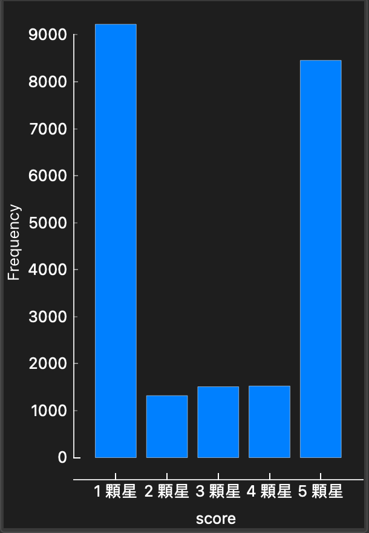
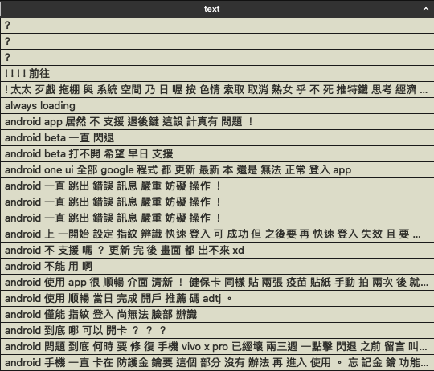

[比賽連結](https://www.kaggle.com/competitions/banking-apps-reviews-classification)

使用該比賽提供的資料集，訓練模型來預測銀行APP留言的星星數。

一天只能夠上傳5次，所以要先擬定好策略在進行上傳。

## 思路
1. 觀察資料
2. 根據資料型態選擇使用的模型或訓練方式
3. 查看模型訓練結果
4. 根據準確率調整資料格式或者模型

## 觀察資料

可以發現訓練資料中1顆星和5顆星比例佔了80%，資料不平衡可能會導致模型表現不佳。

因為測試資料只會給予text欄位，所以可以著重查看text欄位的內容

text特色

1. 長短影響星星數，通常越短的評價星星數會越高，越長的評價通常會是抱怨，星星數較低
2. 常常會有優惠碼的留言，該留言大多會給予五顆星
3. 該資料會有亂碼的情況，可以考慮清理
4. 似乎可以透過正負面詞彙的數量來判斷星星數
5. 列點的留言通常都是回報問題，所以評價不高
6. 因為測試資料只有文字，沒有提供日期欄位，所以text可以考慮刪除日期
7. 常見的開頭(APP, android, good, excellent, OK...)
8. 一直、不開頭的通常是負評
...

## 清洗資料
因為一天測試次數有限，而且資料有點髒，所以決定清洗，請洗步驟為
1. 中文分詞
2. 移除中文停用詞
3. 移除標點符號和特殊字符
4. 將英文文本轉為小寫
5. 移除英文停用詞
6. 詞幹提取、詞形還原（因為大多為中文資料，所以這不可做可不做）

問題：
1. emoji需要額外做辨識

所以重新調整資料清洗步驟
. 中文分詞
. 移除中文停用詞
. 移除數字
. 將英文文本轉為小寫
. 移除指定的特殊符號
. 移除英文停用詞（會導致一些text為空，出現？）
基本上做完上面的步驟，資料就清洗的差不多了，剩下的就是處理表情符號。

- 表情符號處理(demoji)
因為是留言分析，所以想要將表情符到轉換成對應的英文單字

- 去除重複資料(大約有5000筆)

處理完的資料`train_preprocess_v2.csv`

## 選擇模型
其實可以使用預訓練的模型例如BERT，但是需要很高的運算資源，嘗試使用較簡單的方式實作

RNN, LSTM：個人理解是偏向文本生成，時間序列分析
transformer：文本分類、情感分析、翻譯等

一開始使用LogisticRegression，結果只有0.728，分詞結果為：很 不 穩定，評分為5顆星，模型無法理解語意。所以後面使用LSTM

## 根據準確率調整模型
LSTM訓練10個epochs後，準確度上升到0.741
後面調整模型參數後，準確度為0.75686

效果還是不如預期
1. 嘗試只預測好評和差評，若是可以完全預測成功，準確率至少會有八成。
使用GRU：因為LSTM訓練太久，所以改用GRU，訓練5個epochs，準確率為0.754，如果繼續訓練最後準確率應該會逼近1顆星和5顆星所佔的比例(0.8)
2. 處理資料不平衡的問題，將2~4顆星的資料增多，或是將1顆星和5顆星的資料減少
GRU+OverSampling (5+40) epochs，準確率0.378，發現2~4星預測比例大幅提升，

